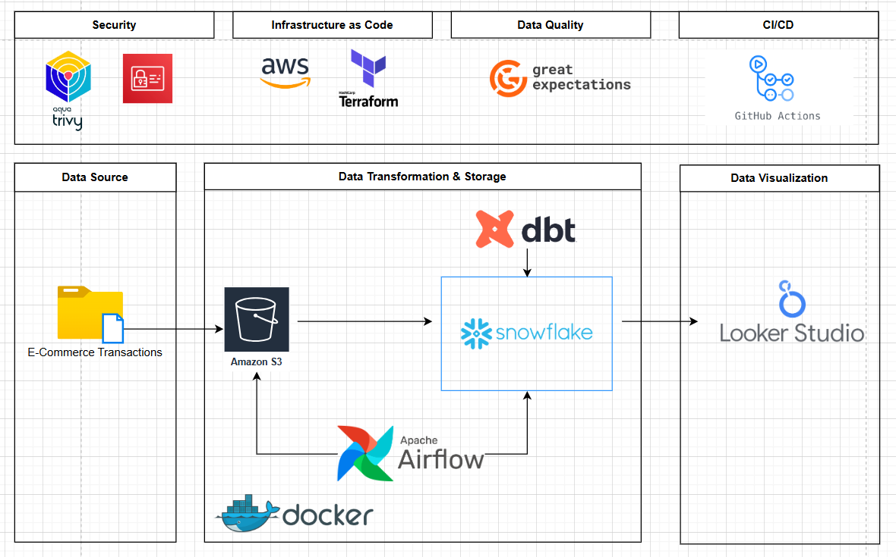

# DataSecOps: Implementing a Secure ELT Pipeline for E-commerce Data Processing.

## Architecture


 

The architecture consists of the following components: 
1. **Data Sources**: A csv file that contains transactions of an ecommerce store.
2. **Data Ingestion**: Python for ingestion.
3. **Data Storage**: Secure data lakes or warehouses (e.g., AWS S3, Snowflake) with encryption at rest.
4. **Data Processing**: ETL tools (dbt) to transform and load data.
5. **Data Security**: Implementation of encryption, access controls, and monitoring.
6. **Data Consumption**: BI tools (e.g., Tableau, Looker) for data analysis and reporting.  
<<<<<<< HEAD
7. **Monitoring & Logging**: Tools like ELK Stack or Prometheus for tracking data pipeline health and security events.


### Iac using Terraform
The infrastructure for this project is provisioned using Terraform. The main components include:
- **Storage Module**: This module creates  storage buckets
- **Iam Module**: This module creates the IAM Users needed 

#### Run Terraform
To deploy the infrastructure, navigate to the `include/terraform` directory and run the following commands
```bash
terraform init
terraform plan
terraform apply
```

=======
7. **Monitoring & Logging**: Tools like ELK Stack or Prometheus for tracking data pipeline health and security events.
>>>>>>> 0f3603ca6751b01c13702fb35ea15200be6bb5e2
# DataOps
